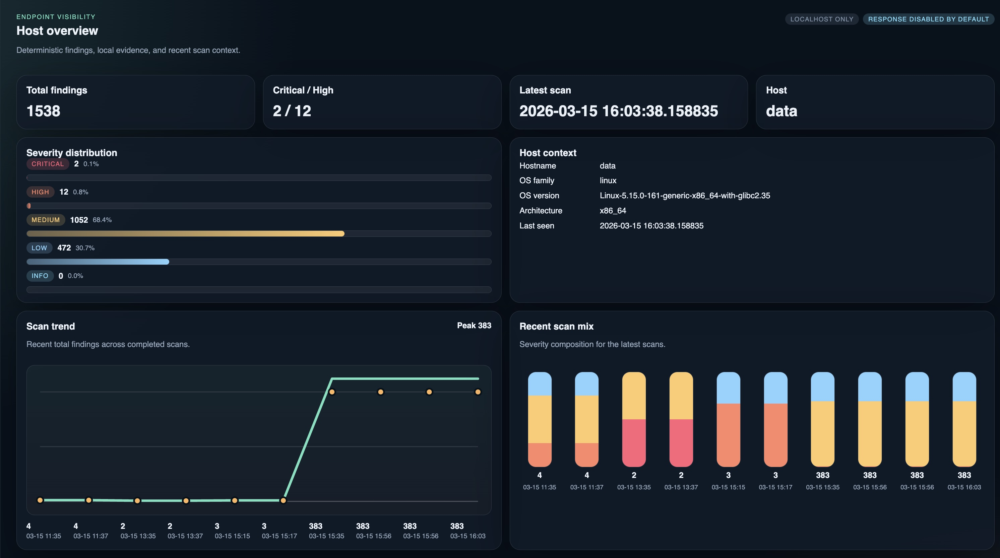
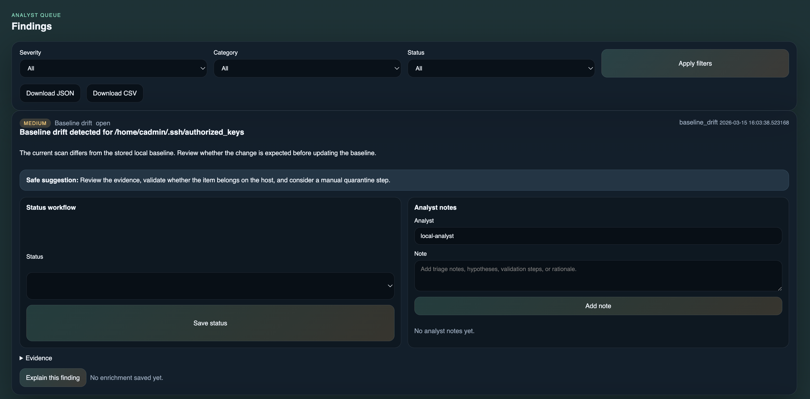

# Driftwatch

Driftwatch is a local-first defensive host security auditing agent for Linux, macOS, and Windows. It collects host telemetry, evaluates deterministic rules, stores results in SQLite, and serves a localhost dashboard for scan history, findings, evidence, and baseline drift review.

This project is intentionally defensive in scope:

- No exploitation
- No privilege escalation
- No credential access features
- No persistence deployment
- No automatic remediation by default

## MVP features

- Cross-platform Python agent with modular collectors
- CLI for scans, scheduled scans, baseline creation/diff, dashboard serving, and demo data
- FastAPI + Jinja local dashboard bound to `127.0.0.1` by default
- Overview and scan-history graphs for severity distribution and scan trends
- SQLite persistence for hosts, scans, findings, evidence, baselines, and settings
- Deterministic rules across process, network, persistence, filesystem, and baseline-drift categories
- Optional LLM explanation abstraction with a safe no-op provider today
- Demo data mode for immediate UI preview

## Repo preview

Live UI preview is available with `driftwatch serve --demo-data`. The repo now includes actual dashboard screenshots:




## Project structure

```text
driftwatch/
  app/
    api/
    collectors/
      linux/
      macos/
      windows/
    core/
    models/
    rules/
    services/
    static/
    templates/
scripts/
tests/
docs/
```

## Quick start

### 1. Create a virtual environment

Linux and macOS:

```bash
./scripts/bootstrap.sh
```

Windows PowerShell:

```powershell
.\scripts\bootstrap.ps1
```

### 2. Seed demo data and launch the dashboard

```bash
driftwatch demo-data
driftwatch serve --demo-data
```

Then open `http://127.0.0.1:8484`.

To bind the dashboard on all interfaces for LAN testing:

```bash
driftwatch serve --demo-data --host 0.0.0.0 --port 8484
```

This is not the default and should be treated as less safe than localhost-only access.

### 3. Run a real local scan

```bash
driftwatch scan
driftwatch serve --scan-on-start
```

## CLI

```bash
driftwatch scan
driftwatch scan --interval-minutes 30 --count 4
driftwatch serve --scan-on-start
driftwatch baseline create
driftwatch baseline diff
driftwatch export findings --format json --output findings.json
driftwatch export scans --format csv --output scans.csv
driftwatch demo-data
```

## Exports

Driftwatch can export stored results from the local SQLite database:

```bash
driftwatch export findings --format json --output findings.json
driftwatch export findings --format csv --output findings.csv
driftwatch export findings --format csv --severity high --status open --output high-open-findings.csv
driftwatch export scans --format json --output scans.json
driftwatch export scans --format csv --status completed --os-family linux --output scans.csv
```

Use `--output -` to write the export to stdout instead of a file.
The findings export supports `--severity`, `--category`, and `--status`. The scan export supports `--status` and `--os-family`.

## Dashboard pages

- Overview: totals, severity counts, latest scan, host context, severity graph, and recent scan trend graph
- Findings: filter by severity, category, and status; analyst notes; and status workflow
- Scan history: timestamped runs with summaries, trend graph, and severity composition bars
- Evidence: raw collector and finding evidence
- Settings: scan paths, exclusions, schedule, optional LLM placeholders
- Rule coverage: implemented rules per operating system

## Defensive detection coverage

### Linux

- Kernel-like process name misuse
- Temp-path process execution
- Outbound SSH burst review
- Cron and systemd inventory
- `authorized_keys` review
- Recent changes under web roots and startup locations
- Deleted-but-running executable checks
- Listening and established connection collection

### macOS

- LaunchAgents and LaunchDaemons inventory
- LoginItems collection where feasible
- Temp and cache process execution checks
- Shell profile and startup path review
- `authorized_keys` review
- Sensitive startup path modification checks

### Windows

- Process and parent relationship collection
- Run and RunOnce registry key inventory
- Startup folder inspection
- Scheduled task inventory
- Service inventory
- Suspicious PowerShell flag detection
- Temp directory executable review
- Startup-related AppData path checks

## Baselines

Driftwatch stores known-good startup and key material locally and can diff new scans against that baseline:

```bash
driftwatch baseline create
driftwatch baseline diff
```

Baseline drift becomes a finding category in regular scans.

## LLM integration

The core product does not require an LLM. Deterministic rules remain primary. The current implementation includes a pluggable explanation interface and a UI button that returns a safe deterministic explanation stub.

Planned providers:

- `none`
- local model backend
- API-backed provider

## Analyst workflow

Driftwatch now supports lightweight local analyst workflow directly in the findings view:

- change finding status between `open`, `investigating`, and `resolved`
- add analyst notes to preserve triage context
- keep notes and status local in SQLite with the rest of the host evidence

## Testing

```bash
pytest
```

## Screenshots / preview

The repository includes real screenshot previews in the project root:

- `driftwatch-overview-preview.png`
- `driftwatch-findings-preview.png`

You can also generate a live local preview immediately with:

```bash
driftwatch serve --demo-data
```

## Future hardening TODOs

See [docs/TODO.md](docs/TODO.md).

## Project status

See [STATUS.md](STATUS.md) for the current implementation state, verified commands, known caveats, and suggested next steps when resuming work.

## License

MIT placeholder. See [LICENSE](LICENSE).
